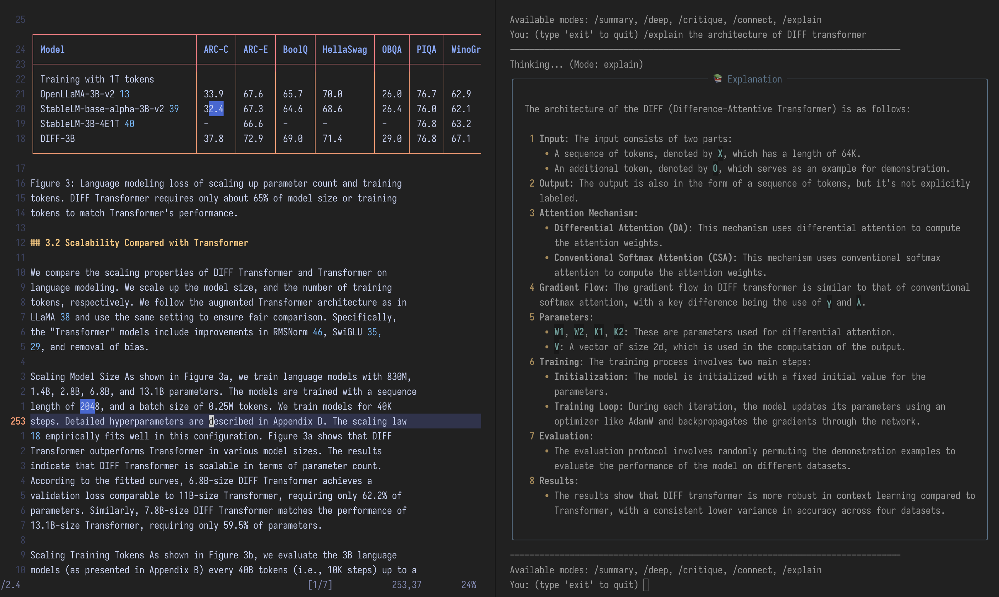

# DeepBoredom Projects

This repository contains source code for YouTube videos created for the
[deepBoredom](https://www.youtube.com/@deepBoredom) channel.

## Projects

### paper-reader

 An
AI-powered academic paper analysis tool that transforms PDFs into markdowns
and enables intelligent paper discussions using local LLMs (no RAG).
